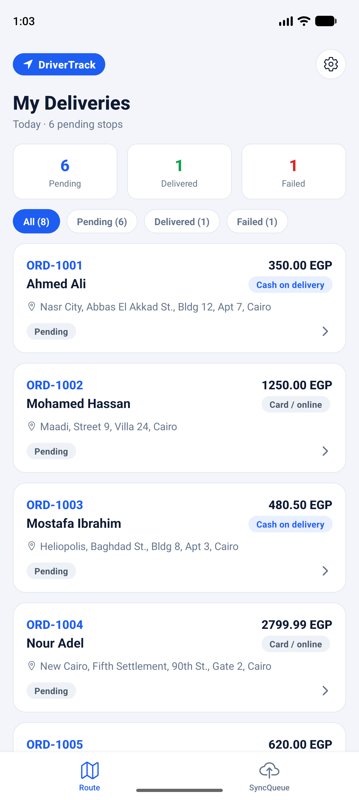
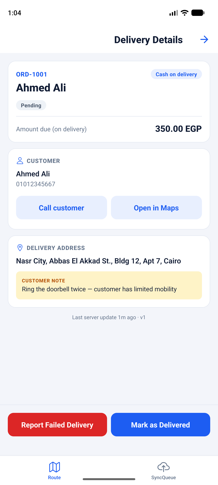
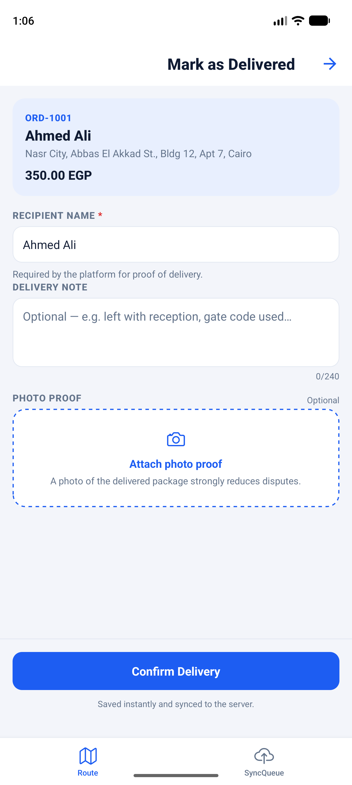
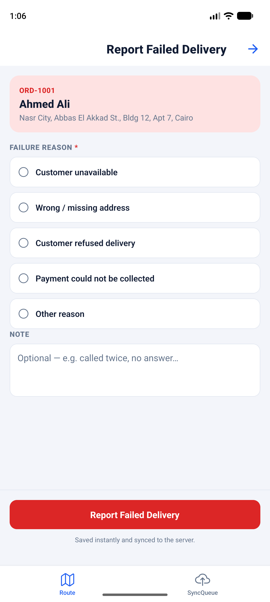
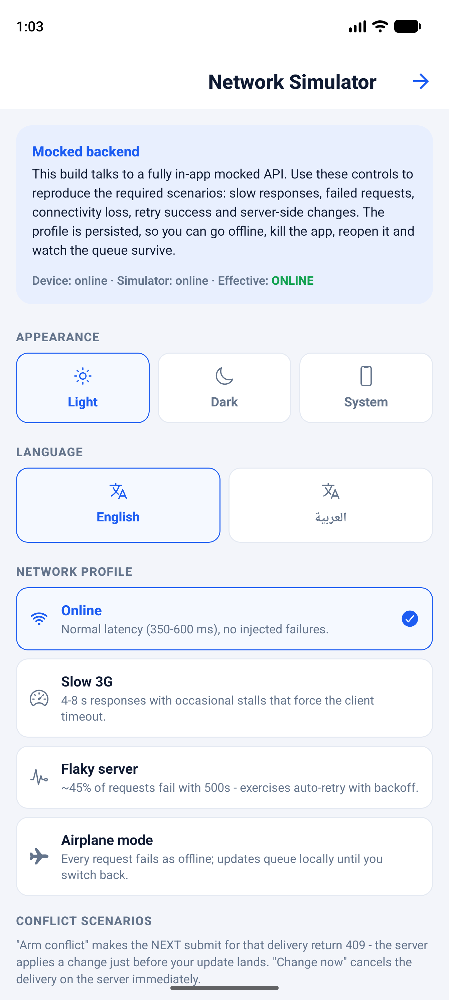
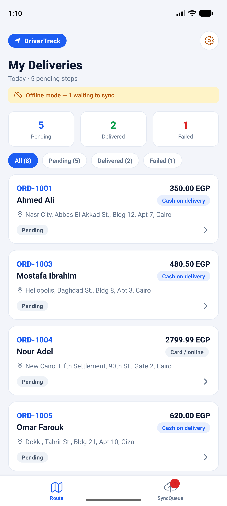
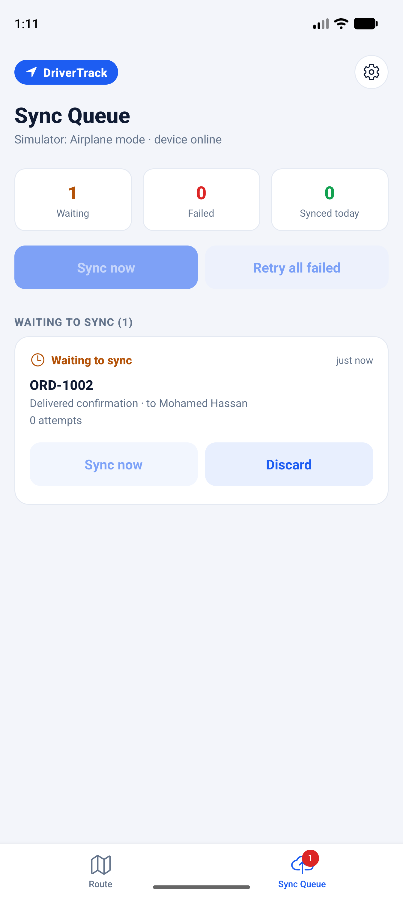
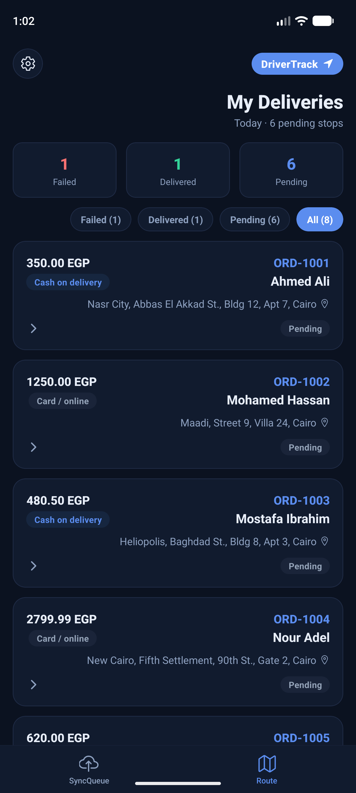
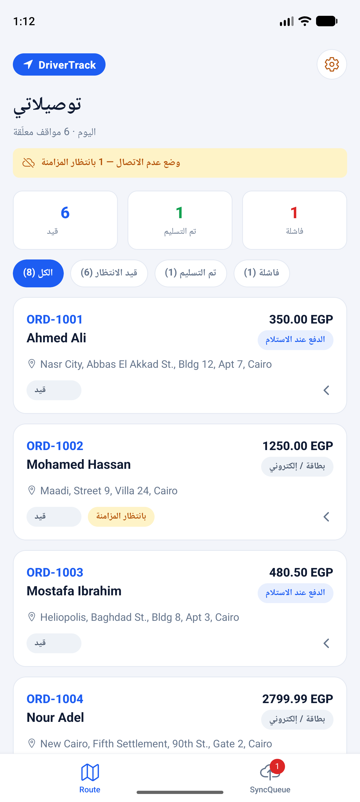

# DriverTrack — Delivery Tracking App

An offline-first mobile app for delivery drivers: view assigned deliveries, mark them
**Delivered** or **Failed**, and keep working reliably through slow or missing
connectivity. Built as a solution to the *Mobile Technical Task — Delivery Tracking App*.

> **Stack:** React Native 0.87 (bare CLI) + TypeScript + React Navigation + Zustand +
> AsyncStorage. No backend required — a fully mocked in-app API simulates realistic
> network behavior (see [Network Simulator](#demo-script--network-simulator)).

---

## Features

| Task requirement | Where |
| --- | --- |
| List of assigned deliveries (loading / error / empty / retry, pull-to-refresh, filters) | `src/screens/DeliveriesListScreen.tsx` |
| Delivery details (customer, address, amount, payment, notes, call & maps deep links) | `src/screens/DeliveryDetailsScreen.tsx` |
| Mark as **Delivered** — recipient name required, optional note + photo proof | `src/screens/CompleteDeliveryScreen.tsx` |
| Mark as **Failed** — reason required, optional note | `src/screens/FailDeliveryScreen.tsx` |
| Pending actions stored locally while offline | `src/storage/outboxRepo.ts` (outbox pattern) |
| Pending actions survive app restarts | AsyncStorage-persisted outbox, hydrated on boot |
| Clear **Synced / Waiting / Failed** status on every update | sync chips on cards, details, and the Sync Queue tab |
| Auto-sync when connectivity returns | connectivity listener + 20s auto-retry tick with backoff |
| No duplicate submissions | one action per delivery + stable `client_action_id` idempotency key |
| Manual retry of failed syncs | Retry buttons on Sync Queue + details, "Retry all failed" |
| Delivery changed on server before submit (conflict) | 409 handling + resolution dialog (discard / keep for review) |
| Mocked API with all required behaviors | `src/api/mockServer.ts` + in-app **Network Simulator** |

## Screenshots

| | |
|---|---|
|  |  |
|  |  |
|  |  |
|  |  |

Arabic RTL: 

The full client guide with these screenshots is in
[docs/DriverTrack-Client-Guide.pdf](docs/DriverTrack-Client-Guide.pdf).

**Beyond the task brief:** the app also ships **dark mode** (light / dark / follow-system,
persisted), full **Arabic localization with RTL mirroring** (switch languages from the
settings screen), and a branded **native splash screen** on Android and iOS.

## Getting started

```bash
npm install

# Android
npm run android

# iOS (first run needs pods)
bundle install
bundle exec pod install
npm run ios
```

Tests and typecheck:

```bash
npm test          # 24 unit tests (mock API, outbox persistence, sync engine)
npx tsc --noEmit  # strict typecheck
```

## Demo script & Network Simulator

The app ships with a **Network Simulator** (gear icon on any screen header) that
drives the mocked backend. Every behavior the task asks the mock API to simulate is
reproducible from the UI:

1. **Normal flow** — open a pending delivery → *Mark as Delivered* → confirm. The
   card immediately shows **Syncing…** then **Synced**.
2. **Offline queueing** — Simulator → *Airplane mode* → complete a delivery. It is
   saved locally and shows **Waiting to sync** with an offline banner on the list.
3. **Persistence across restarts** — still offline, kill and reopen the app. The
   queued update is still there (simulator settings persist too).
4. **Auto-sync on reconnect** — switch back to *Online*. The queue drains by
   itself and the update flips to **Synced**.
5. **Failed requests + successful retry** — *Flaky server* (~45% injected 500s):
   watch attempts climb on the Sync Queue, then succeed. After 3 failed attempts an
   action parks as **Failed to sync** and offers manual retry.
6. **Slow responses / timeouts** — *Slow 3G* has 4–8s latency plus stalls that
   force the client timeout (retryable).
7. **Duplicate protection** — the server registry replays the original result for a
   repeated `client_action_id` (covered by unit tests; the UI additionally blocks a
   second action for the same delivery).
8. **Server-side conflict** — pick a delivery → *Arm conflict*, then submit. The
   server changes the order right before your update lands and returns **409** with
   its state; the app shows the *Delivery changed on server* dialog → **Discard my
   update** or **Keep for dispatch review**.

## Architecture in one paragraph

`UI (screens)` talks only to a Zustand store. The store owns the in-memory state,
persists through thin repositories (AsyncStorage), and delegates all network work to
a `SyncEngine`. Driver actions are recorded as `PendingAction`s in a durable
**outbox** (one per delivery, each with a stable `client_action_id`) and applied
optimistically to the local cache; the engine drains the outbox FIFO when online,
with exponential backoff for retryable failures, parking as `failed` after 3
attempts, and parking `409` responses as `conflict` for the user to resolve. The
API is an interface (`src/api/types.ts`) with a mock implementation whose latency,
failure rate, stalls and offline mode are controlled by the simulator — swapping in
a real HTTP client touches one file. Full details in
[docs/ARCHITECTURE.md](docs/ARCHITECTURE.md).

## Assumptions

- **Conflict definition:** a submit conflicts when the delivery is no longer
  `pending` server-side (already delivered/failed/cancelled by someone else).
  The server response carries the authoritative state for the resolution dialog.
- **"Keep for dispatch review"** leaves the conflicting action in the queue,
  excluded from all automatic sync; the user or dispatch later discards or retries it.
- **Failed syncs need manual retry** by design; `waiting` actions retry
  automatically (backoff 5s→60s, 3 attempts). This keeps "failed" a state the
  driver actively sees and acts on, per the task.
- **Photo proof** is picked from the gallery/camera, stored as a local file URI and
  uploaded (mocked) *before* the complete action, once per action.
- **Single driver, no auth.** The task focuses on delivery + sync behavior.
- Phone/address actions use `tel:` and Google Maps deep links.
- Amounts are EGP with two decimals; the mock dataset uses Egyptian names,
  addresses and mobile numbers (Cairo, Giza, Alexandria).

## Project structure

```
src/
  api/        mock server, network profiles, transport-agnostic Api interface, errors
  storage/    KeyValue port + deliveries cache, outbox, synced log, simulator repos
  sync/       connectivity (NetInfo wrapper) + SyncEngine (outbox drain, backoff, conflicts)
  store/      Zustand store: bootstrap, refresh merge, submit/retry/discard, selectors
  screens/    list, details, complete, fail, sync queue, network simulator
  components/ cards, chips, banner, dialogs, state views, buttons
  navigation/ bottom tabs (Route / Sync Queue) + native stack
  theme/      design tokens
tests/        Jest unit tests for the mock API, repos and sync engine
```
